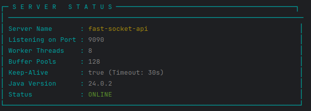

# fast-socket-api: A High-Performance Asynchronous Networking Library

**fast-socket-api** is a modern, high-performance networking library. It provides a simple yet powerful API for building
scalable, robust, and efficient client-server applications. By abstracting away the complexities of asynchronous socket
programming, buffer management, and protocol framing, fast-socket-api allows you to focus on your application's logic.

### Server Startup

Upon a successful launch, the server will display a status banner in the console. This banner provides a quick overview
of the key configuration parameters and confirms that the server is online and ready to accept connections.



### Dependency

To add as dependency:

```xml
<dependency>
    <groupId>io.github.sk8erboi17</groupId>
    <artifactId>fast-socket-api</artifactId>
    <version>1.0.0</version>
</dependency>
```

## Key Advantages 🚀

- **Lightweight**: The library is designed to be lightweight, requiring only a single dependency for logging:
  logback-classic. This keeps the project setup simple and avoids potential dependency conflicts.
- **Highly Scalable**: Built with `AsynchronousSocketChannel` to handle thousands of concurrent connections with a
  small, fixed number of threads, ensuring minimal resource consumption.
- **Memory Efficient**: Utilizes a central `ByteBuffersPool` to reuse direct memory buffers (`ByteBuffer`). This
  significantly reduces garbage collection overhead, prevents memory fragmentation, and boosts overall performance.
- **Robust Framing Protocol**: Implements a clear, length-prefixed framing protocol to ensure message integrity. This
  prevents common stream-based issues like partial reads or message concatenation, guaranteeing that you always receive
  complete data frames.
- **Developer-Friendly API**: Features a clean pipeline design that separates concerns: I/O (`DataEncoder`/
  `DataDecoder`), protocol (`FrameEncoder`/`FrameDecoder`), and application logic (`PipelineIn`/`PipelineOut`). This
  makes the code easier to write, read, and maintain.

## Core Concepts

### The Packet Structure

fast-socket-api uses a simple and effective custom binary protocol to structure all data sent over the network. \
This ensures that the receiver can accurately parse and understand incoming messages. Each piece of data is sent as a "
frame."

The **structure** of a single frame is as follows:

```
+--------------+-------------------+------------------+-----------------------+
| START_MARKER |   FRAME_LENGTH    |  DATA_TYPE_MARKER|        PAYLOAD        |
|   (1 byte)   |     (4 bytes)     |     (1 byte)     |       (N bytes)       |
+--------------+-------------------+------------------+-----------------------+
```

- **START_MARKER**: A constant byte (`0x01`) that signals the beginning of a new frame. The `FrameDecoder` uses this to
  synchronize the stream and discard any garbage data between valid frames.
- **FRAME_LENGTH**: A 4-byte integer representing the total length of the parts that follow it (i.e.,
  `DATA_TYPE_MARKER` + `PAYLOAD`). This allows the receiver to know exactly how many bytes to read to get one complete
  message.
- **DATA_TYPE_MARKER**: A single byte that identifies the type of data in the payload (e.g., `0x01` for a String, `0x02`
  for an Integer). This tells the deserializer how to interpret the payload bytes.
- **PAYLOAD**: The actual data being sent. For variable-length data like strings or byte arrays, the payload itself is
  prefixed with its own length.

### The Data Pipelines

The library is built around the concept of separate inbound and outbound data pipelines.

#### Outbound Pipeline (Sending Data) 📤

- **PipelineOut**: Your high-level interface. You create a `Request` object containing the data and pass it to the
  `handle` method.
- **FrameEncoder**: The protocol layer. It takes your data, constructs the full binary frame in a pooled `ByteBuffer`.
- **DataEncoder**: The I/O layer. It performs the asynchronous write operation on the socket channel and releases the
  buffer back to the pool.

#### Inbound Pipeline (Receiving Data) 📥

- **DataDecoder**: The I/O layer. It runs an asynchronous read loop, reading incoming bytes into a pooled `ByteBuffer`.
- **FrameDecoder**: The protocol layer. It scans the buffer for a valid frame, reads its length, and extracts the
  payload.
- **ReceiveData Callback**: The `FrameDecoder` deserializes the payload and invokes your `ReceiveData` callback,
  delivering the ready-to-use Java object to your application logic.

## Configuration

The library's server-side behavior is configured through a `server_options.properties` file.

### File Location

For the library to automatically load the configuration, this file must be placed in your project's classpath, typically
in the `src/main/resources` directory of a standard Maven/Gradle project.

### Configuration Parameters

Here is an example of the `server_options.properties` file and an explanation of each parameter:

```properties
#Default Server Options
#Mon Aug 25 19:32:14 CEST 2025
bufferPools=128
keepAlive=true
threadsNumber=8
timeout=30
```

| Parameter       | Description                                                                                                                                                                                              | Default         |
|-----------------|----------------------------------------------------------------------------------------------------------------------------------------------------------------------------------------------------------|-----------------|
| `bufferPools`   | Controls the number of pre-allocated `ByteBuffer` objects in the memory pool for each buffer size (small, medium, large).                                                                                | 128             |
| `keepAlive`     | A boolean (`true` or `false`) that enables or disables the `SO_KEEPALIVE` socket option. When `true`, the operating system will periodically send keep-alive probes on idle connections.                 | true            |
| `threadsNumber` | Sets the size of the server's core thread pool used for handling I/O and connection events. This should typically be tuned based on the number of available CPU cores.                                   | 8               |
| `timeout`       | Specifies the I/O read timeout in seconds. If no data is received from a client within this period, the connection is considered inactive and may be closed. This only applies if `keepAlive` is `true`. | 30 seconds      |
| `server_name`   | Sets the server name shown in the welcome message upon startup.                                                                                                                                          | fast-socket-api |

## Usage Examples

The following is a practical example of a client-server application. The server listens for connections and assigns a
`ReceiveData` handler in a round-robin fashion. The client connects, sends a message, and listens for the echo.

### Server-Side Implementation

The `Server.java` class initializes the server, listens for incoming connections, and sets up the communication
pipelines.

```java
package example;

import example.requests.SendEcho;
import example.responses.ReceiverOne;
import example.responses.ReceiverTwo;
import api.io.github.sk8erboi17.ConnectionRequest;
import api.io.github.sk8erboi17.Listener;
import callbacks.listeners.io.github.sk8erboi17.ReceiveData;
import input.api.io.github.sk8erboi17.AsyncServerSocket;
import in.pipeline.api.io.github.sk8erboi17.PipelineIn;
import out.pipeline.api.io.github.sk8erboi17.PipelineOut;

import java.io.IOException;
import java.net.InetSocketAddress;
import java.nio.channels.AsynchronousServerSocketChannel;
import java.nio.channels.AsynchronousSocketChannel;
import java.util.ArrayList;
import java.util.List;
import java.util.concurrent.atomic.AtomicInteger;

public class Server {

    public static ArrayList<ReceiveData> receiveData = new ArrayList<>(List.of(
            new ReceiverOne(),
            new ReceiverTwo()
    ));

    private static final Listener listener = Listener.getInstance();
    private static final AsynchronousServerSocketChannel serverSocketChannel = AsyncServerSocket.createInput(new InetSocketAddress(9090));

    public static void main(String[] args) throws IOException {

        System.out.println("Server started on port 9090. Waiting for connections...");
        AtomicInteger counter = new AtomicInteger(0);
        listener.startConnectionListen(serverSocketChannel, new ConnectionRequest() {

            @Override
            public void onConnectionAccepted(AsynchronousSocketChannel socketChannel) {
                counter.incrementAndGet();
                System.out.println("(" + counter.get() + ")Accepted connection");
                new PipelineIn(socketChannel, 8192, receiveData.get(counter.get() % 2));
                new PipelineOut(socketChannel).handle(new SendEcho());
            }

            @Override
            public void onConnectionFailed(Throwable exc) {
                System.err.println("Connection failed to be accepted: " + exc.getMessage());
                exc.printStackTrace();
            }
        });
    }
}
```

**Explanation:**

- The server starts on port 9090.
- It maintains a list of two different `ReceiveData` handlers: `ReceiverOne` and `ReceiverTwo`.
- When a new client connection is accepted (`onConnectionAccepted`), it uses an `AtomicInteger` to assign a handler in a
  round-robin fashion (`counter.get() % 2`). This demonstrates how you can apply different business logic for different
  connections.
- For each new connection, it immediately sets up an inbound pipeline (`PipelineIn`) with the selected handler and an
  outbound pipeline (`PipelineOut`), which it uses to send an initial "Hi" message via a `SendEcho` request.

There are the `receiveData` classes:

```java
package example.responses;

import callbacks.listeners.io.github.sk8erboi17.ReceiveData;

public class ReceiverOne implements ReceiveData {
    @Override
    public void receive(Object data) {
        System.out.println("(1) Received data: " + data);
    }

    @Override
    public void exception(Throwable throwable) {
        throwable.printStackTrace();
    }
}

```

```java
package example.responses;

import callbacks.listeners.io.github.sk8erboi17.ReceiveData;

public class ReceiverTwo implements ReceiveData {
    @Override
    public void receive(Object data) {
        System.out.println("(2) Received data: " + data);
    }

    @Override
    public void exception(Throwable throwable) {
        throwable.printStackTrace();
    }
}

```

### Client-Side Implementation

The `Client.java` class connects to the server, prepares to receive data, and sends an initial message.

```java
package example;

import example.requests.SendEcho;
import example.responses.Echo;
import output.api.io.github.sk8erboi17.AsyncClientSocket;
import in.pipeline.api.io.github.sk8erboi17.PipelineIn;
import out.pipeline.api.io.github.sk8erboi17.PipelineOut;

import java.net.InetSocketAddress;
import java.nio.channels.AsynchronousSocketChannel;

public class Client {

    public static void main(String[] args) {
        AsynchronousSocketChannel socketChannel = AsyncClientSocket.createChannel(new InetSocketAddress("localhost", 9090));
        new PipelineIn(socketChannel, 1024 * 4, new Echo());
        PipelineOut pipeline = new PipelineOut(socketChannel);
        pipeline.handle(new SendEcho());

        Runtime.getRuntime().addShutdownHook(new Thread(() -> {
            AsyncClientSocket.closeChannelSocketChannel(socketChannel);
            AsyncClientSocket.shutdown();
        }));
    }
}
```

**Explanation:**

- The client connects to localhost on port 9090.
- It immediately configures its inbound pipeline (`PipelineIn`) with an `Echo` handler, which will process any messages
  received from the server.
- It then uses its outbound pipeline (`PipelineOut`) to send a `SendEcho` request, which contains the message "Hi".
- A shutdown hook is registered to ensure that the socket channel is closed and library resources are released when the
  application terminates.

### Request and Response Logic

#### The Request Object

The `SendEcho.java` class is a reusable request object that encapsulates the data to be sent and the callback logic for
when the send operation completes.

```java
package example.requests;

import callbacks.listeners.io.github.sk8erboi17.SendData;
import requests.out.pipeline.api.io.github.sk8erboi17.Request;

public class SendEcho implements Request {
    @Override
    public String message() {
        return "Hi";
    }

    @Override
    public SendData callback() {
        return new SendData() {

            @Override
            public void onSendComplete() {
                System.out.println("Send complete");
            }

            @Override
            public void exception(Throwable throwable) {
                throwable.printStackTrace();
            }
        };
    }
}
```

#### The ReceiveData Handler

The `ReceiveData` interface is implemented to define the application logic for handling incoming data. Below is a
conceptual example of what the client's `Echo.java` handler might look like.

```java
package example.responses;

import callbacks.listeners.io.github.sk8erboi17.ReceiveData;

public class Echo implements ReceiveData {
    @Override
    public void receive(Object data) {
        System.out.println(data);
    }

    @Override
    public void exception(Throwable throwable) {
        throwable.printStackTrace();
    }
}

```

